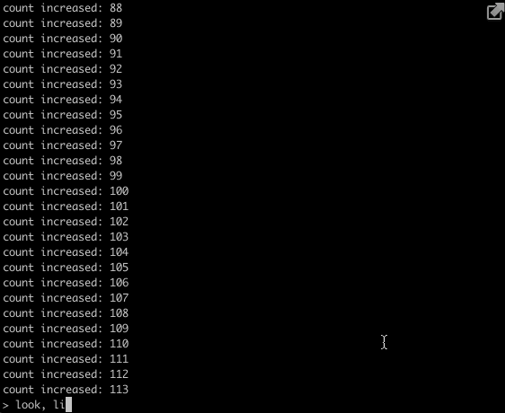

# entero

A tiny CLI that leaves the prompt at the bottom.

# Usage

**index.js**
```javascript
const entero = require('entero')

entero({
  prompt: '> ',
  onLine: (line) => console.log(new Date().toLocaleTimeString(), '💬', line),
  commands: {
    help: () => console.log('on my way! \n(っ▀¯▀)つ'),
    display: (...args) => console.log('args passed:', ...args),
    point: () => console.log('oh, what is the point?')
  }
})


// Testing
let count = 0
setInterval(() => { console.log('count increased:', count++) }, 1000)

```
```
$ node index.js
```



# templates

```javascript
const cli = entero({
  prompt: '> ',
  onLine: console.log,
  templates: {
    highlightnick: ({ nickname }) => `\x1b[36m${nickname}\x1b[0m`,
    encrypt: ({ msg }) => [].map.apply(msg, [(s) => s.charCodeAt()]).join('*')
  }
})

cli.log('highlightnick', { nickname: 'max estrella' }) //  max estrella  **cyan**
cli.log('encrypt', { msg: 'secrets!' }) // 115*101*99*114*101*116*115*33

```

You can mix it with packages like `chalk`

# Completions

When passing commands, completions are set automatically, but more completions can be set up once instantiated. Pressing tab will trigger completions if a match occurs.

```javascript
cli.setCompletion('@home')
cli.setCompletion('#tag')
cli.setCompletion('.foo', '.bar')
```